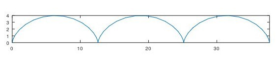
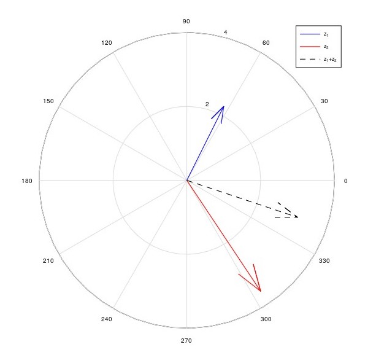

# 
Лабораторная работа №7

**Автор: Асеева Яна Олеговна**

**Группа: НПМмд-02-23**

## Цель выполнения лабораторной работы

Целью работы является изучить построение графиков в Octave.

## График трех периодов циклоиды радиуса 2 ##

## График в полярных координатах

## График неявных функций

## График в комплексной плоскости

## Специальные функции

## Вывод

В ходе выполнения работы я научилась строить графики в Octave.

