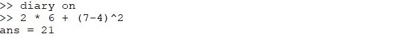
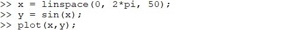

---
## Front matter
lang: ru-RU
title: Лабораторная работа №3
author: Асеева Яна Олеговна
documentclass: article
papersize: a4
toc: false
slide_level: 2
aspectratio: 20
section-titles: true
##Fonts
fontsize: 12pt
mainfont: PT Serif
romanfont: PT Serif
sansfont: PT Sans
monofont: PT Mono
mainfontoptions: Ligatures=TeX
romanfontoptions: Ligatures=TeX
sansfontoptions: Ligatures=TeX,Scale=MatchLowercase
monofontoptions: Scale=MatchLowercase,Scale=0.9
---

# 
Лабораторная работа №3

**Автор: Асеева Яна Олеговна**

**Группа: НПМмд-02-23**

## Цель выполнения лабораторной работы

Целью работы является познакомиться с работой в Octave.

## Octave

**Octave** – это высокоуровневый язык программирования, в первую очередь предназначенный для численных расчетов. Он предоставляет удобный консольный интерфейс для решения линейных и нелинейных задач численно, а также для проведения других численных экспериментов используя язык, большей частью совместимый с языком Matlab. Его также можно использовать как язык, ориентированый на пакетную обработку(batch-oriented language).

## Octave

В Octave есть обширный набор инструментов для решения общих проблем численной линейной алгебры, нахождения корней нелинейных уравнений, интегрирования стандартных функций, работы с полиномами и интегрирования обычных дифференциальных и дифференциально-алгебраических уравнений. Он также легко расширяется пользовательскими функциями написанными на самом Octave или через динамически подключаемые модули, написанные на С++, С, Fortran или других языках.

## Простейшие операции

## Операции с векторами

## Матричные операции

## Построение графиков

## Вывод

В ходе выполнения работы я познакомилась с работой в Octave.

