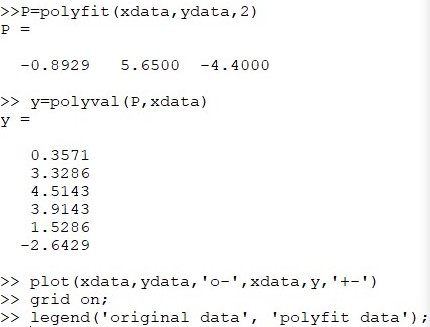
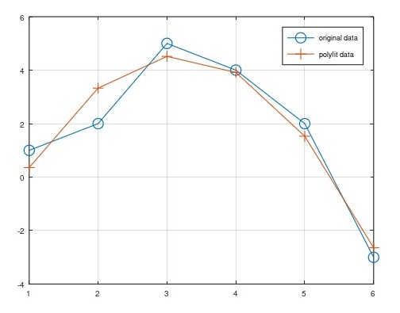
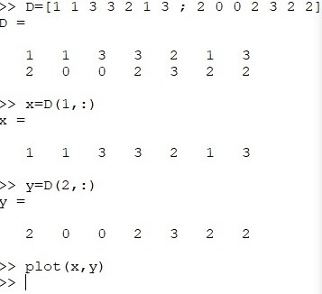
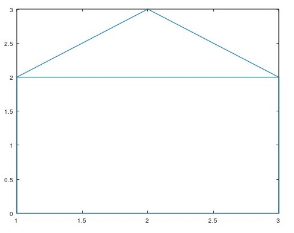
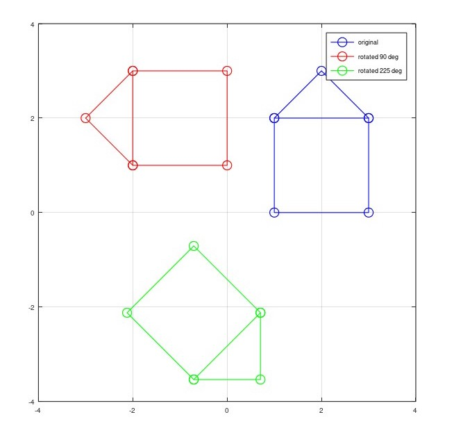
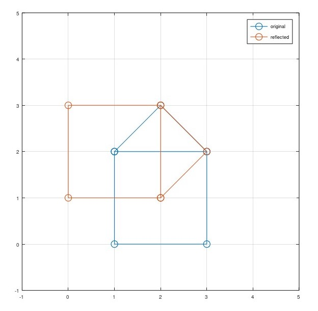
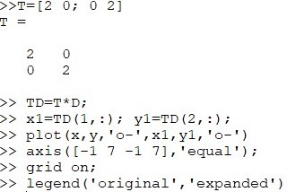
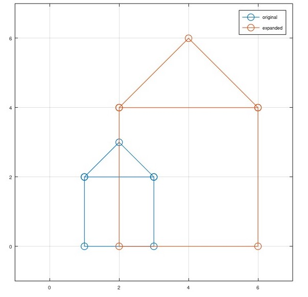

---
## Front matter
lang: ru-RU
title: Лабораторная работа №5
author: Асеева Яна Олеговна
documentclass: article
papersize: a4
toc: false
slide_level: 2
aspectratio: 20
section-titles: true
##Fonts
fontsize: 12pt
mainfont: PT Serif
romanfont: PT Serif
sansfont: PT Sans
monofont: PT Mono
mainfontoptions: Ligatures=TeX
romanfontoptions: Ligatures=TeX
sansfontoptions: Ligatures=TeX,Scale=MatchLowercase
monofontoptions: Scale=MatchLowercase,Scale=0.9
---

# 
Лабораторная работа №5

**Автор: Асеева Яна Олеговна**

**Группа: НПМмд-02-23**

## Цель выполнения лабораторной работы

Целью работы является освоить подгонку полиномиальной кривой, матричные преобразования, вращение, отражение и дилатацию в Octave.

## Подгонка полиномиальной кривой

В статистике часто рассматривается проблема подгонки прямой линии к набору данных. Решим более общую проблему подгонки полинома к множеству точек. 

## Матричные преобразования

Матрицы и матричные преобразования играют ключевую роль в компьютерной графике. Существует несколько способов представления изображения в виде матрицы. 

## Вращение

Рассмотрим различные способы преобразования изображения. Вращения могут быть получены с использованием умножения на специальную матрицу. 

## Отражение

## Дилатация

Дилатация (то есть расширение или сжатие) также может быть выполнено путём умножения матриц.

## Вывод

В ходе выполнения работы я освоила подгонку полиномиальной кривой, матричные преобразования, вращение, отражение и дилатацию в Octave.

