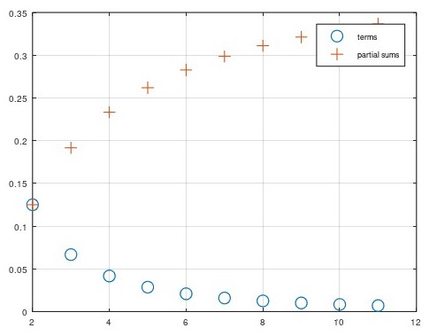
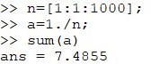
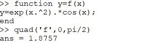
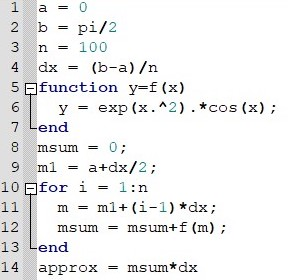
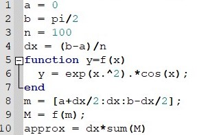

# 
Лабораторная работа №6

**Автор: Асеева Яна Олеговна**

**Группа: НПМмд-02-23**

## Цель выполнения лабораторной работы

Целью работы является изучить пределы, последовательности, ряды и численное интегрирование в Octave.

## Octave ##

Octave — полноценный язык программирования, поддерживающий множество типов циклов и условных операторов. Однако, поскольку это векторный язык, многие вещи, которые можно было бы сделать с помощью циклов, можно векторизовать. Под векторизованным кодом мы понимаем следующее: вместо того, чтобы писать цикл для многократной оценки функции, мы сгенерируем вектор входных значений, а затем оценим функцию с использованием векторного ввода. В результате получается код, который легче читать и понимать, и он выполняется быстрее благодаря эффективным алгоритмам для матричных операций.

## Частичные суммы

## Сумма ряда

Рассмотрим различные способы преобразования изображения. Вращения могут быть получены с использованием умножения на специальную матрицу. 

## Интегралл 

## Аппроксимирование суммами

## Вывод

В ходе выполнения работы я изучила пределы, последовательности, ряды и численное интегрирование в Octave.

