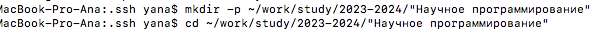

---
## Front matter
lang: ru-RU
title: Лабораторная работа №2
author: Асеева Яна Олеговна
documentclass: article
papersize: a4
toc: false
slide_level: 2
aspectratio: 20
section-titles: true
##Fonts
fontsize: 12pt
mainfont: PT Serif
romanfont: PT Serif
sansfont: PT Sans
monofont: PT Mono
mainfontoptions: Ligatures=TeX
romanfontoptions: Ligatures=TeX
sansfontoptions: Ligatures=TeX,Scale=MatchLowercase
monofontoptions: Scale=MatchLowercase,Scale=0.9
---

# 
Лабораторная работа №2

**Автор: Асеева Яна Олеговна**

**Группа: НПМмд-02-23**

## Цель выполнения лабораторной работы

Целью работы является научиться оформлять отчёты с помощью легковесного языка разметки Markdown.

## Регистрация на GitHub

## Создание репозитория

## Базовая настройка git

## Создание ключей и добавление в GitHub

## Создание курса и отправка в Github

## Вывод

В ходе выполнения работы я научилась оформлять отчёты с помощью легковесного языка разметки Markdown.

