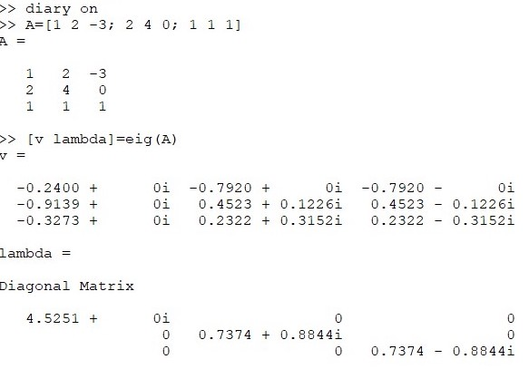
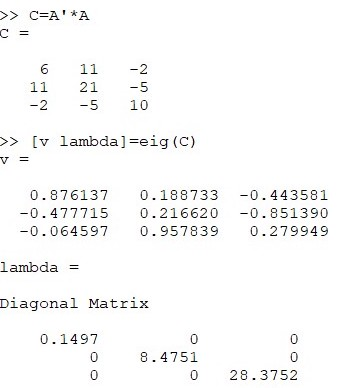
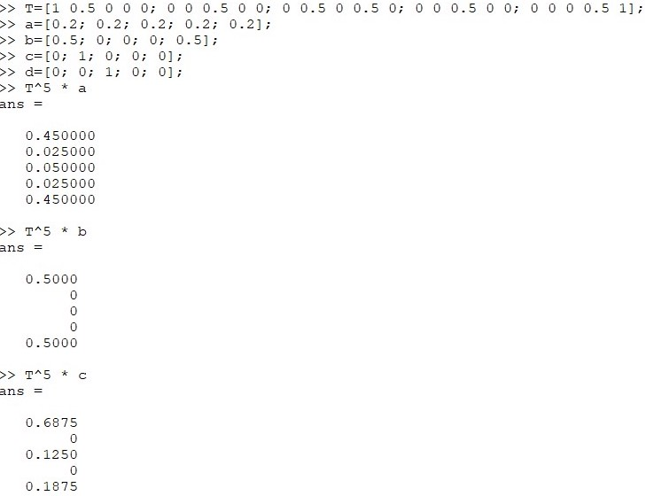
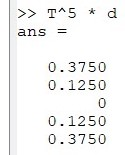
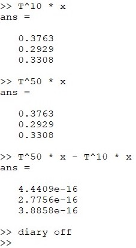

# 
Лабораторная работа №8

**Автор: Асеева Яна Олеговна**

**Группа: НПМмд-02-23**

## Цель выполнения лабораторной работы

Целью работы является изучить задачу на собственные значения в Octave.

## Вычислю собственные значения и собственные векторы ##

## Вычислю собственные значения и собственные векторы

## Рассмотрю марковские цени, в частности случайное блуждение

## Рассмотрю марковские цени, в частности случайное блуждение

## Рассмотрю марковские цени, в частности случайное блуждение

## Вывод

В ходе выполнения работы я изучила задачу на собственные значения в Octave.

